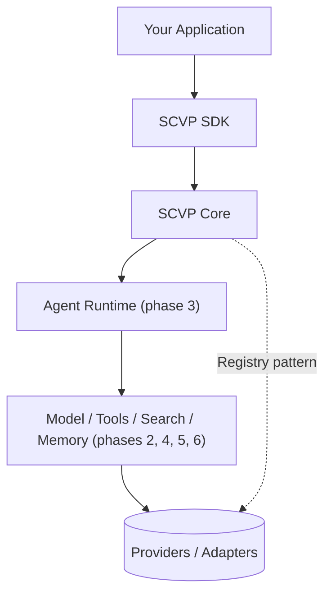

# SCVP — Scalable Cognitive Virtual Platform

SCVP is a provider-agnostic AI agent framework/SDK. It's infrastructure to
build *on top of* — not a chatbot. Agents, tool-using assistants,
Discord/Telegram/WhatsApp bots, research agents, RAG assistants,
multi-agent systems, and AI-powered APIs are all meant to sit on the same
SCVP core, swapping providers (model, search, memory, ...) without
touching application code.

> **Status:** Phase 0 (Architecture) + Phase 1 (Core) + Phase 2 (Model
> Interface) + the Phase 3 Agent Runtime MVP are done and covered by tests. Everything
> under "Roadmap" below that isn't checked is designed but not yet built.
> SCVP is built phase by phase — the next phase doesn't start until the
> one before it is stable.

## Why is there no real model yet?

SCVP doesn't assume a real model provider exists — inventing one would be
worse than not having one. So this phase ships with exactly one fully
real, fully working provider: `MockModelProvider`. It's deterministic and
has zero external dependencies, and it makes the whole model interface
(`generate`, `chat`, `stream`, `embed`, `classify`, `reason`) runnable and
testable today, with no API keys required. Swapping in a real provider
later (OpenAI-compatible, Anthropic-compatible, Ollama, llama.cpp, ...)
will never require changing code written against `SCVPModel`.

## Architecture



Every layer only depends on the interfaces below it, never on a concrete
provider. `scvp.core.registry.Registry` is the one mechanism every
swappable layer (models today; tools, search, memory in later phases)
uses to register and resolve a named provider — Core never imports
`OpenAIProvider` or `RedisMemory` directly.

## Repository layout

```
scvp/
├── core/                    # config, logging, exceptions, registry, shared types
├── models/                  # ModelProvider interface, SCVPModel, MockModelProvider
│   └── providers/mock.py
├── agents/                  # Agent, planner, executor, and sequential runtime
├── tools/                   # Injectable SCVPTool contract and ToolResult
└── cli/                     # `scvp` command (init, model, agent/tool/plugin stubs)
    └── templates/minimal/   # `scvp init` starter template
tests/                       # pytest suite for everything above
examples/quickstart.py       # runnable end-to-end example
```

Layers not built yet (`search/`, `memory/`, `knowledge/`, `plugins/`, `api/`,
`sdk/`, ...) will each land in their own
phase, as an independent, replaceable module under `scvp/` — exactly as
laid out in the architecture above.

## Install

```bash
cd scvp
pip install -e ".[dev]"
```

## Quickstart

```python
from scvp import Message, Role, SCVPModel

model = SCVPModel(provider="mock")
response = model.chat([Message(role=Role.USER, content="Hello, SCVP!")])
print(response.content)
```

Or scaffold a starter project with the CLI:

```bash
scvp init my-agent
cd my-agent
python main.py
```

Run a provider-agnostic agent with the built-in mock model:

```python
from scvp import Agent

agent = Agent(name="support")
result = agent.run("Explain what SCVP is.")
print(result.content)
```

The current Agent Runtime is intentionally sequential. It supports injected
tools, custom planners, explicit step limits, and typed execution state.
Multi-agent orchestration and parallel execution are later phases.

Run the full walkthrough (chat, stream, embed, classify):

```bash
python examples/quickstart.py
```

## Configuration

Put a `scvp.config.yaml` (or `.json`) in your project root. It's
overridable by `SCVP_`-prefixed environment variables (`__` = nesting):

```yaml
model:
  provider: mock
```

```bash
export SCVP_MODEL__PROVIDER=mock   # overrides model.provider
```

Secrets (API keys, etc.) are **never** read from the config file — only
from environment variables (see `.env.example`) — so `scvp.config.yaml`
is always safe to commit.

## Run the tests

```bash
pytest
```

## Roadmap

- [x] Phase 0 — Architecture
- [x] Phase 1 — Core (config, logging, exceptions, registry, types)
- [x] Phase 2 — Model Interface (`ModelProvider`, `SCVPModel`, Mock provider) — *started*
- [x] Phase 3 — Agent Runtime (sequential MVP)
- [ ] Phase 4 — Tool System
- [ ] Phase 5 — Memory
- [ ] Phase 6 — Search
- [ ] Phase 7 — RAG / Knowledge
- [ ] Phase 8 — API
- [ ] Phase 9 — Plugins
- [ ] Phase 10 — SDK (Bot SDK, Web SDK)
- [ ] Phase 11 — CLI (full command surface)
- [ ] Phase 12 — Testing (integration/security suites)
- [ ] Phase 13 — Documentation

## Design principles

- **No provider lock-in.** Core never imports a concrete vendor SDK.
- **Real over fake.** No empty stub files — every file in this repo runs
  and is covered by a test.
- **Secrets stay in the environment**, never in source or config files.
- **Fail loud.** Missing config, unregistered providers, and unsupported
  capabilities raise a specific, typed exception instead of a silent
  no-op.

## License

MIT — see `LICENSE`.
